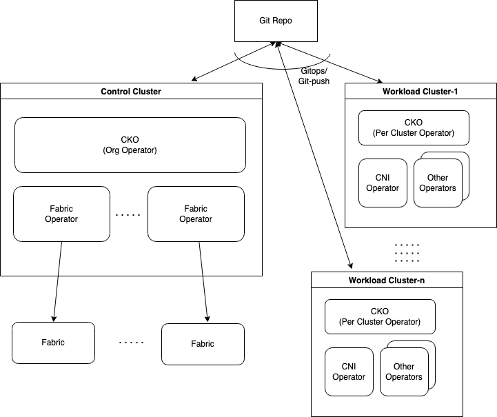

# CKO
Cisco Kubernetes Operator (CKO) - An Operator for managing networking for Kubernetes clusters and more.

# Table of Contents

- [1. Introduction](#1-introduction)
- [2. Features](#2-features)
  - [2.1 Supported Integrations](#21-supported-integrations)
  - [2.2 Under Development](#22-under-development)
- [3. Deploying CKO](#3-deploying-cko)
  - [3.1 Control Cluster](#31-control-cluster)
    - [3.1.1 Prequisites](#311-prequisites)
    - [3.1.2 Install cert-manager](#312-install-cert-manager)
    - [3.1.3 Create Secret for Github access](#313-create-secret-for-github-access)
    - [3.1.4 Deploy using Helm](#314-deploy-using-helm)
  - [3.2 Workload Cluster](#32-workload-cluster)
    - [3.2.1 Create Secret for Github access](#321-create-secret-for-github-access)
    - [3.2.2 Deploy Manifests](#322-deploy-manifests)
- [4. Using CKO](#4-using-cko)
  - [4.1 Workflows](#41-workflows)
    - [4.1.1 Fabric Onboarding](#411-fabric-onboarding)
      - [4.1.1.1 Fabric Identity](#4111-fabric-identity)
      - [4.1.1.2 Fabric Resources for Brownfield Clusters](#4112-fabric-resources-for-brownfield-clusters)
      - [4.1.1.3 Fabric Resources for Greenfield Clusters](#4113-fabric-resources-for-greenfield-clusters)
        - [4.1.1.3.1 Subnets and VLANs](#41131-subnets-and-vlans)
        - [4.1.1.3.2 External Connectivity](#41132-external-connectivity)
        - [4.1.1.3.3 Topology](#41133-topology)
        - [4.1.1.3.4 BGP](#41134-bgp)
      - [4.1.1.4 Allocation Status](#4114-allocation-status)
    - [4.1.2 Brownfield Clusters](#412-brownfield-clusters)
      - [4.1.2.1 Unmanaged CNI](#4121-unmanaged-cni)
      - [4.1.2.2 Managed CNI](#4122-managed-cni)
    - [4.1.3 Greenfield Clusters](#413-greenfield-clusters)
    - [4.1.4 Managing Clusters as a Group](#414-managing-clusters-as-a-group)
    - [4.1.5 Managing Clusters Individually](#415-managing-clusters-individually)
    - [4.1.6 Customizing Default Behaviors](#416-customizing-default-behaviors)
    - [4.1.7 Upgrade Managed CNI Operators](#417-upgrade-managed-cni-operators)
    - [4.1.8 Upgrade CKO in Workload Cluster](#418-upgrade-cko-in-workload-cluster)
    - [4.1.9 Deleting CKO from Workload Cluster](#419-deleting-cko-from-workload-cluster)
    - [4.1.10 Upgrade Control Cluster](#4110-upgrade-control-cluster)
  - [4.2 API Reference](#42-api-reference)
  - [4.3 Sample Configuration](#43-sample-configuration)
- [5. Observability & Diagnostics](#5-observability--diagnostics)
  - [5.1 Diagnostics on the Control Cluster](#51-diagnostics-on-the-control-cluster)
  - [5.2 Diagnosticson on the Workload Clusters](#52-diagnostics-on-the-workload-cluster)
- [6. Troubleshooting](#6-troubleshooting)
- [7. Contributing](#7-contributing)
  - [7.1 Repositories](#71-repositories)
  - [7.2 Contributing to CKO](#72-contributing-to-cko)
  - [7.3 Experimenting with Control Cluster](#73-experimenting-with-control-cluster)
- [Appendix](#Appendix)
  - [Single Node Control Cluster](#single-node-control-cluster)
  - [Control Cluster Install Configuration](#control-cluster-install-configuration)
  - [CKO Cleanup in Workload Cluster](#cko-cleanup-in-workload-cluster)

## 1. Introduction

The [CNCF Cloud Native Landscape](https://landscape.cncf.io/?grouping=category) illustrates the rich and rapidly evolving set of projects and compnents in the Cloud Native Networking domain. Using these components requires installation and operational knowledge of each one of those. It also leaves the burden on the user to harmonize the configuration across the networking layers and components to ensure that everything works in sync. This gets even more complicated when you consider that most production solutions run applications which are deployed across multiple Kubernetes clusters.

CKO aims to alleviate this complexity and reduce the operational overhead by:
* Automation - Providing resource management across network resources and automating the composition of networks and services
* Observability - Providing observability by correlating between clusters and infrastructure, by centralized data collection and eventing, and by health check and reporting at global level
* Operations - Providing operational benefits via centralized network governance, migration of workloads, and cost optimization across cluster sprawl
* Security - Providing multi-cluster security by federating identity across domains

CKO achieves this by defining simple abstractions to meet the needs of he following persona:
* Kubernetes Admin - responsible for managing the cluster
* Cloud Admin - responsible for the coordinating the infrastructure needs of a cluster
* Network Admin - responsible for the network infrastructure

These abstractions are modeled to capture the user's intent and then consistently apply it across the infrastructure components. The abstractions are:
* ClusterProfle - defined by the Kubernetes Admin to express the network needs for the cluster they intend to manage
* ClusterGroupProfile - defined by the Cloud Admin to match the networking needs of all matching clusters with network and other infrastructure
* ClusterNetworkProfile - defined by the Cloud Admin to match the specific needs of one cluster
* FabricInfra - defined by the Network Admin to model each discrete physical or virtual network infrastructure unit that provides pod, node and external networking capabilities to the cluster

The diagram below illustrates the relationship between these abstactions.


The abstractions ensure that these persona can seamlessly collaborate to dynamically satisfy the networking needs of the set of clusters they manage. The abstractions are flexible and can be applied to a group of clusters which can be managed as a whole, or can be used to create individual snowflakes. 

The diagram below illustrates a typical CKO deployment comprising of one Control Cluster and one or more Workload Clusters with the following CKO components:
* A centralized "Org Operator" for identity and resource management 
* One or more "Fabric Operators" for network infrastructure automation and kubernetes manifest generation
* "Per Cluster Operators" for managing the lifecycle of network components in the Workload Cluster

The Workload Cluster runs the user's applications. The lifecycle of all the clusters is managed by the user; CKO only requires that specific operators be run in these. The lifecycle of CKO in the Workload Cluster, once deployed, is managed by the Control Cluster.



## 2. Features
This release includes the following features:

* An Extensible Framework for CNI Lifecycle Management and Reporting
* Centralized Management comprising of
    * Network Data Model
    * CNI Asset Generation
    * CNI Upgrades
    * Connectivity Reporting

### 2.1 Supported Integrations
This release has support for:

* ACI Fabric 5.2
* ACI-CNI 5.2.3.4
* Calico CNI with Tigera Operator 3.23
* OCP 4.10
* Kubernetes 1.22, 1.23, 1.24

### 2.2 Roadmap Items Under Development
Support for the following technologies and products is being actively pursued:

| Feature       |  Product                                                 |
|---------------|----------------------------------------------------------|
| Network Infra | * Cisco Nexus Standalone (NDFC)<br> * AWS EKS            |
| CNI           | * AWS VPC<br> * Cilium<br> * OpenShift SDN               |
| Distributions | * Rancher                                                |
| Service Mesh  | * Cisco Calisti<br> * Istio<br> * OpenShift Service Mesh |
| Loadbalancer  | * MetalLB                                                |
| Ingress       | * NGINX                                                  |
| Monitoring    | * Prometheus<br> * Open Telemetry                        |
| DPU           | * Nvidia Bluefield                                       |

The above list is not comprehensive and we are constantly evaluating and adding new features for support based on user demand.

## 3. Deploying CKO
CKO requires one Control Cluster to be deployed with the CKO operators before any Workload Clusters can be managed by CKO. Existing Workload Clusters with a functioning CNI can be imported into CKO.

### 3.1 Control Cluster
This section describes the setup of the Control Cluster that manages the Workload Clusters.

#### 3.1.1 Prequisites
* A functional Kubernetes cluster with reachability to the ACI Fabric that will serve as the Control Cluster. A single node cluster is adequate, refer to [Appendix](#single-node-control-cluster) for a quick guide on how to set up one.
* kubectl
* Helm

#### 3.1.2 Install cert-manager

``` bash
helm repo add jetstack https://charts.jetstack.io
helm repo update
helm install \
  cert-manager jetstack/cert-manager \
  --namespace cert-manager \
  --create-namespace \
  --version v1.10.0 \
  --set installCRDs=true
  --wait
```

#### 3.1.3 Create Secret for Github access
CKO follows the [GitOps](https://www.weave.works/technologies/gitops/) model using [Argo CD](https://github.com/argoproj/argo-cd) for syncing configuration between Control and Workload clusters. The Git repository details can be provided as shown below. The configuration below assumes that the Git repository is hosted in Github. You can optionally add the HTTP_PROXY details if your clusters require it to communicate with Github.

```bash
kubectl create ns netop-manager

kubectl create secret generic cko-config -n netop-manager \
--from-literal=repo=https://github.com/<ORG>/<REPO> \
--from-literal=dir=<DIR> \
--from-literal=branch=<BRANCH NAME> \
--from-literal=token=<GITHUB PAT> \
--from-literal=user=<GIT USER> \
--from-literal=email=<GIT EMAIL> \
--from-literal=http_proxy=<HTTP_PROXY> \
--from-literal=https_proxy=<HTTPS_PROXY> \
--from-literal=no_proxy=<add-any-other-IP-as-needed>,10.96.0.1,.netop-manager.svc,.svc,.cluster.local,localhost,127.0.0.1,10.96.0.0/16,10.244.0.0/16,control-cluster-control-plane,.svc,.svc.cluster,.svc.cluster.local

kubectl create secret generic cko-argo -n netop-manager \
--from-literal=url=https://github.com/<ORG>/<REPO> \
--from-literal=type=git  \
--from-literal=password=<GIT PAT> \
--from-literal=username=<GIT USER> \
--from-literal=proxy=<HTTP_PROXY>

kubectl label secret cko-argo -n netop-manager 'argocd.argoproj.io/secret-type'=repository
```

#### 3.1.4 Deploy using Helm
Use the template provided in the [Appendix](#control-cluster-install-configuration) to create the ```my_values.yaml``` used during the helm install of CKO in the control cluster. It sets the relevant image registries, tags and optionally HTTP-Proxy configuration.

``` bash

helm repo add cko https://noironetworks.github.io/netop-helm
helm repo update
helm install netop-org-manager cko/netop-org-manager -n netop-manager --create-namespace --version 0.9.0 -f my_values.yaml --wait
```

Argo CD is automatically deployed in the Control Cluster (in the netop-manager namespace) and in the Workload Cluster (in the netop-manager-system namespace). By default Argo CD starts reconciliation with the git repository every [180s](https://github.com/argoproj/argo-cd/blob/master/docs/operator-manual/argocd-cm.yaml#L283). The reconciliation time depends on the number of objects being synchronized and can potentially take longer at times. If more frequent synchronization is required you can follow the process described [here](https://www.buchatech.com/2022/08/how-to-set-the-application-reconciliation-timeout-in-argo-cd/) to reduce time interval between the reconciliation start times.

### 3.2 Workload Cluster
CKO handles the integration and management of the CNI in the Workload Clusters as two distinct cases:
* Brownfield - The Workload Cluster already exists with a fully functioning and supported CNI. An import workflow is used to make the CNI in such a cluster visible to the Control Cluster. In the Brownfield case CKO further provides the choice of (a) only observing, or (b) fully managing the CNI, and referred to as "Unmanaged" or "Managed" states respectively. The import workflow upon successful completion will always result in the "Unmanaged" state. The CNI can be moved to a "Managed" state through an explicit action by the user. Please refer to the [Brownfield case workflow](#412-brownfield-clusters) section for proceeding further.
* Greenfield - A new Workload Cluster needs to be installed. The network configuration for this planned cluster is initiated from the Control Cluster by creating the relevant ClusterProfile and/or ClusterGroupProfile/ClusterNetworkProfile CRs. Please refer to the [Greenfield case workflow](#413-greenfield-clusters) section for proceeding further.

The rest of this section provides the steps for deploying the CKO components in the Workload Cluster. However, prior to any action in the Workload Cluster, the user needs to identify and initiate the appropriate [Brownfield case workflow](#412-brownfield-clusters) or the [Greenfield case workflow](#413-greenfield-clusters) at least once for the Workload Cluster under consideration. 

#### 3.2.1 Create Secret for Github access
Provide the same Git repository details as those in the Control Cluster.

```bash
kubectl create ns netop-manager-system

kubectl create secret generic cko-config -n netop-manager-system \
--from-literal=repo=https://github.com/<ORG>/<REPO> \
--from-literal=dir=<DIR> \
--from-literal=branch=<BRANCH NAME> \
--from-literal=token=<GITHUB PAT> \
--from-literal=user=<GIT USER> \
--from-literal=email=<GIT EMAIL> \
--from-literal=systemid=<SYSTEM ID> \
--from-literal=http_proxy=<HTTP_PROXY> \
--from-literal=https_proxy=<HTTPS_PROXY> \
--from-literal=no_proxy=<NO_PROXY>

kubectl create secret generic cko-argo -n netop-manager-system \
--from-literal=url=https://github.com/<ORG>/<REPO> \
--from-literal=type=git  \
--from-literal=password=<GIT PAT> \
--from-literal=username=<GIT USER> \
--from-literal=proxy=<HTTP_PROXY>

kubectl label secret cko-argo -n netop-manager-system 'argocd.argoproj.io/secret-type'=repository
```

* When importing a cluster with a functional ACI CNI (Brownfield case), the ```systemid``` parameter in the above secret should match the one mentioned in the ```system_id``` section of the acc-provision input file. In all other cases, the ```systemid``` can be set to a relevant name that establishes an identity for this cluster (hyphen is not permitted in the name per ACI convention).

* If the HTTP proxy is set, the following need to be added to the no-proxy configuration:

    * In the Kubernetes case: 
    ```
    10.96.0.1,localhost,127.0.0.1,172.30.0.1,172.30.0.10,<node-IPs>,<node-host-names>,<any-other-IPs-which-need-to-be-added>
    ```

    * In the OpenShift case: 
    ```
    oauth-openshift.apps.<based-domain-from-install-config-yaml>.local,console-openshift-console.apps.<based-domain-from-install-config-yaml>.local,downloads-openshift-console.apps.<based-domain-from-install-config-yaml>.local,localhost,127.0.0.1,172.30.0.1,172.30.0.10,<node-IPs>,<node-host-names>,<any-other-IPs-which-need-to-be-added>
    ```

    * In the Calico CNI case:\
    In addition to the above, add ```.calico-apiserver.svc```

#### 3.2.2 Deploy Manifests

For OpenShift Cluster:

``` bash

kubectl apply -f https://raw.githubusercontent.com/noironetworks/netop-manifests/cko-mvp-1/workload/netop-manager-openshift.yaml
kubectl create -f https://raw.githubusercontent.com/noironetworks/netop-manifests/cko-mvp-1/workload/platformInstaller.yaml
```

For non-OpenShift Cluster:

``` bash

kubectl apply -f https://raw.githubusercontent.com/noironetworks/netop-manifests/cko-mvp-1/workload/netop-manager.yaml
kubectl create -f https://raw.githubusercontent.com/noironetworks/netop-manifests/cko-mvp-1/workload/platformInstaller.yaml
```

## 4. Using CKO

### 4.1 Workflows

#### 4.1.1 Fabric Onboarding
Each network infrasructure unit (referred to as a fabric) that is managed as an independent entity, is modeled in CKO using the FabricInfra CRD. The network admin creates a FabricInfra CR to establish the identity of the of that fabric, and allows the network admin to specify the set of resources available to be consumed on that fabric. CKO reserves these resources in the FabricInfra on the cluster's behalf, and performs the necessary provisioning on the fabric to enable the networking for the cluster.

##### 4.1.1.1 Fabric Identity
The following fields are required when creating the FabricInfra:

```bash
  credentials:
    hosts:
    - <APIC-IP-1>
    - ...
    secretRef:
      name: apic-credentials
  fabric_type: aci
  infra_vlan: <infra-vlan-value>
```

The secretRef property refers to a Kubernetes Secret for the APIC username and password. It can be created as follows (note that the name of the Secret should match that in the secretRef, in this case the name is ```apic-credentials```):

```bash
kubectl create secret -n netop-manager generic apic-credentials --from-literal=username=<APIC_USERNAME> --from-literal=password=<APIC_PASSWORD>
```

The username provided above should have privileges to access at least the "common" tenant on the APIC.

##### 4.1.1.2 Fabric Resources for Brownfield Clusters
Fabric requirements for subnets, VLAN and external connectivity do not need to be explicitly defined in the FabricInfra spec for imported clusters. Since these resources are already in use on the fabric, CKO will learn them at the time of importing a particular cluster, and automatically reserve them in the FabricInfra. These resources will however not be released to the available pool when the imported cluster is removed from CKO.

If dealing only with brownfield clusters no further configuration is required to be specified in the FabricInfra.

##### 4.1.1.3 Fabric Resources for Greenfield Clusters
Fabric resources needed for a cluster can be individually specified as a part of the ClusterProfile or the ClusterNetworkProfile. Alternatively, fabric resources needed for multiple clusters can be optionally specified as pools in the FabricInfra spec such that allocations can be made to individual clusters on demand. If the fabric resources are not specified as a part of the ClusterProfile or ClusterNetworkProfile, the required resources are allocated from the available pools of resources.

##### 4.1.1.3.1 Subnets and VLANs
The snippet below shows how subnets used for node networks, multicast (for ACI-CNI), external connectivity, and VLANs (for ACI-CNI) for node and service networks can be specified: 

```bash
  ...
  mcast_subnets:
    - 225.114.0.0/16
    - 225.115.0.0/16
  internal_subnets:
    - 1.100.101.1/16
    - 2.100.101.1/16
    - 10.5.0.1/16
    - 10.6.0.1/16
    - 20.2.0.1/16
    - 20.5.0.1/16
  external_subnets:
    - 10.3.0.1/16
    - 10.4.0.1/16
    - 20.3.0.1/16
    - 20.4.0.1/16
  vlans:
    - 101
    - 102
    - 103
    - 104
    ...
```

If fabric resources are being allocated from the FabricInfra pools, at least two internal subnets, one multicast subnet, two external subnets, and two VLANs need to be available for a greenfield cluster with ACI-CNI, or at least one external subnet needs to be available for a greenfield cluster with Calico CNI.

CKO will automatically pick available resources from resource pools. Resources are picked in round-robin fashion. CKO currently does not partition the subnets, so each subnet specified in the resource pool is treated as an indivisible pool. If smaller subnets are desired, they should be listed as individual subnets.

Note: The pod subnet is not picked from the pool since its local to a cluster. It defaults to ```10.2.0.0/16``` and can be overridden in the ClusterProfile, or ClusterGroupProfile, or ClusterNetworkProfile.

##### 4.1.1.3.2 External Connectivity
The kubernetes_node-to-fabric and fabric-to-external connectivity on each fabric is encapsulated in the context property of the FabricInfra. For example in the case of the ACI fabric, the following example shows the context and its constituent properties:

```bash
  ...
  contexts:
    context-1:
      aep: bm-srvrs-aep
      l3out:
        name: l3out-1
        external_networks:
        - l3out-1_epg
      vrf:
        name: l3out-1_vrf
        tenant: common
    ...
```

At least one context is required for each cluster, and all fields in the context are required. CKO currently does not create ACI AEP, VRF, and L3out; they have to be created by the network admin and referenced in the above configuration.

##### 4.1.1.3.3 Topology
The kubernetes_nodes and top-of-the-rack interconnection topology per fabric is captured in the topology section as shown below:

```bash
  topology:
    rack:
    - id: 1
      aci_pod_id: 1
      leaf:
      - id: 101
      - id: 102
      node:
      - name: k8s-node1
      - name: k8s-node2
    - id: 2
      aci_pod_id: 1
      leaf:
      - id: 103
      - id: 104
      node:
      - name: k8s-node3
      - name: k8s-node4
```

The specification of the topology section is required when the fabric is intended to be used for clusters with the Calico CNI, its optional if only the ACI-CNI is intended to be deployed. The rack and aci_pod_id properties are user defined, where as the lead IDs correspond to their correponding values on the fabric.

Note: If deploying more than one cluster with Calico CNI, current limitations require the topology to be specified as a part of the ClusterNetworkProfile.

##### 4.1.1.3.4 BGP
The BGP configuration for the fabric can be specified as follows:

```bash
  bgp:
    remote_as_numbers:
      - 64512
    aci_as_number: 2
```

The specification of the bgp section is required when the fabric is intended to be used for the Calico CNI, its optional if only the ACI-CNI is intended to be deployed.

##### 4.1.1.4 Allocation Status
All avaliable and allocated resource are refelected in the status field of the FabricInfra as shown in the example below:

```bash
status:
  allocated:
  - cluster_profile: bm2acicni
    context:
      aep: bm-srvrs-aep
      l3out:
        external_networks:
        - sauto_l3out-1_epg
        name: sauto_l3out-1
      vrf:
        name: sauto_l3out-1_vrf
        tenant: common
    external_subnets:
    - 10.3.0.1/16
    - 10.4.0.1/16
    internal_subnets:
    - 1.100.101.1/24
    - 10.6.0.1/16
    - 10.5.0.1/16
    mcast_subnets:
    - 225.114.0.0/16
    vlans:
    - 101
    - 102
  available:
    contexts:
      context-2:
        aep: bm-srvrs-calico-aep
        l3out:
          external_networks:
          - sauto_l3out-3_epg
          name: sauto_l3out-3
        vrf:
          name: sauto_l3out-3_vrf
          tenant: common
    external_subnets:
    - 20.3.0.1/16
    - 20.4.0.1/16
    internal_subnets:
    - 1.100.101.1/16
    - 2.100.101.1/16
    - 20.2.0.1/16
    - 20.5.0.1/16
    mcast_subnets:
    - 225.115.0.0/16
    remote_as_numbers:
    - 64512
    vlans:
    - 103
    - 104
```

The complete API spec for the FabricInfra can be found here: [CRD](docs/control-cluster/api_docs.md#fabricinfra)

An example of the FabricInfra CR can be found here: [Example CR](config/samples/aci-cni/kubernetes/fabricinfra.yaml)

#### 4.1.2 Brownfield Clusters
Existing clusters with a functional CNI provisioned with acc-provision flavors for release 5.2.3.4 can be imported into CKO. Please refer to the following documentation for installing a cluster with ACI CNI or Calico CNI on ACI:
* ACI CNI
    * [Cisco ACI and Kubernetes Integration](https://www.cisco.com/c/en/us/td/docs/switches/datacenter/aci/apic/sw/kb/b_Kubernetes_Integration_with_ACI.html#task_ggz_svz_r1b)
    * [Installing OpenShift 4.10 on Bare Metal](https://www.cisco.com/c/en/us/td/docs/dcn/aci/containers/installation/installing-openshift-4-10-on-baremetal.html)
    * [Installing OpenShift 4.10 on OpenStack 16.2](https://www.cisco.com/c/en/us/td/docs/dcn/aci/containers/installation/openshift-on-openstack/installing-openshift-4-10-on-openstack-16-2.html)
    * [Installing OpenShift 4.10 on VMware vSphere](https://www.cisco.com/c/en/us/td/docs/dcn/aci/containers/installation/openshift-on-vsphere/installing-openshift-4-10-on-vmware-vsphere.html)
* Calico CNI
    * [Cisco ACI and Calico 3.23.2 Integration](https://www.cisco.com/c/en/us/td/docs/dcn/aci/containers/installation/cisco-aci-calico-integration/cisco-aci-with-calico-integration.html)

 The imported cluster will initially have its CNI in an observed, but unmanaged, state by CKO. After succesfully importing the cluster, the CNI can be transitioned to a managed state after which the CNI's configuration and lifecycle can be completely controlled from the Control Cluster.

##### 4.1.2.1 Unmanaged CNI
* Pre-requisite: The network admin has on-boarded the fabric by creating a [FabricInfra CR](#4111-fabric-identity).

This worfklow is initiated in the Workload Cluster which needs to be imported.

The first step is to create the secrets to access a Github repo as shown [here](#321-create-secret-for-github-access).

Then apply the CKO workload cluster operator manifests as show [here](#322-deploy-manifests).

Once applied, the notification to import the cluster will be sent to the Control Cluster via Gitops. Once Argo CD syncs on the Control Cluster you will see the following following two resources getting created:

- [ClusterProfile](config/samples/aci-cni/kubernetes/imported/auto-clusterprofile.yaml) with name: ```auto-<cluster-name>```
- [ClusterNetworkProfile](config/samples/aci-cni/kubernetes/imported/auto-clusternetworkprofile.yaml) with name: ```auto-<cluster-name>```

The status of the imported cluster can now be tracked in the Control Cluster. 

##### 4.1.2.2 Managed CNI
* Pre-requisite: A cluster with an associated ClusterProfile is present (this will have happened if the import workflow was successful as described in the [previous section](#4121-unmanaged-cni)). 

Change the following in the relevant ClusterProfile:

```bash
...
  operator_config:
    mode: unmanaged
...
```

to:


```bash
...
  operator_config:
    mode: managed
...
```

This will trigger the workflow on the workload cluster once Argo CD syncs, such that the installed CNI will be managed by the Control Cluster.

#### 4.1.3 Greenfield Clusters
* Pre-requisite: The network admin has on-boarded the fabric by creating a [FabricInfra CR](#4111-fabric-identity). In addition, depending on the CNI that is intended to be deployed, additional FabricInfra configuration may be required as indicated in the section [Fabric Resources for Greenfield Clusters](#4113-fabric-resources-for-greenfield-clusters). As such, for existing ACI users already familiar with configuring the acc-provision input file, the [Brownfield workflow](#412-brownfield-clusters) might be preferable to on-ramp their clusters (even new clusters) as opposed to this Greenfield workflow.

* Note that in the Calico CNI case the topology model in the FabricInfra is currently resrticted to specifying host-level connectivity only for a single Workload Cluster. This can be worked around by explicitly specifying the topology per cluster in the ClusterProfile or ClusterNetworkProfile CRs.

The user creates a simple ClusterProfile and specifies the CNI.

For ACI-CNI:
```bash
apiVersion: netop.mgr/v1alpha1
kind: ClusterProfile
metadata:
  name: <cluster-name>
  namespace: netop-manager
spec:
  cni: aci
```

For Calico-CNI:
```bash
apiVersion: netop.mgr/v1alpha1
kind: ClusterProfile
metadata:
  name: <cluster-name>
  namespace: netop-manager
spec:
  cni: calico
```

This will result in a choice of an available FabricInfra and the allocation of relevant resource on that fabric. On success, the ClusterProfile status will reflect the allocated resources such that it can be used in the cluster installation. For example:

```bash
...
status:
  aci_cni_config:
    version: 5.2.3.4
  cluster_network_profile_name: bm2acicni
  context:
    aep: bm-srvrs-aep
    l3out:
      external_networks:
      - sauto_l3out-1_epg
      name: sauto_l3out-1
    vrf:
      name: sauto_l3out-1_vrf
      tenant: common
  external_subnets:
  - 10.3.0.1/16
  - 10.4.0.1/16
  fabricinfra:
    context: context-1
    name: k8s-bm-2
  internal_subnets:
  - 1.100.101.1/24
  - 10.6.0.1/16
  - 10.5.0.1/16
  mcast_subnets:
  - 225.114.0.0/16
  node_subnet: 1.100.101.1/24
  node_vlan: 101
  operator_config:
    mode: unmanaged
    version: 0.8.0
  pod_subnet: 10.6.0.1/16
  ready: true
  vlans:
  - 101
  - 102
  workload_cluster_manifest_locations:
  - 'argo: https://github.com/networkoperator/ckogitrepo/tree/test/workload/argo/bm2acicni'
  - 'operator: https://github.com/networkoperator/ckogitrepo/tree/test/workload/config/bm2acicni' 
```

When the ClusterProfile is deleted, the allocated resources are returned to the avaliable pool.

The ClusterProfile API also allows to specify all the configurable details with regards to the CNI if the user wants to choose specific values for the fields. For resources that are chosen from the FrabricInfra, those resources will have to be available in the FabricInfra.

The complete API spec for the ClusterProfile can be found here: [CRD](docs/control-cluster/api_docs.md#clusterprofile)

An example of the ClusterProfile CR can be found here: [Example CR](config/samples/aci-cni/kubernetes/clusterprofile_aci.yaml)

Once the ClusterProfile CR is created successfully, the focus shifts to the Workload Cluster to deploy CKO operator by following these [instructions](#32-workload-cluster). This will result in CKO running in the Workload Cluster and which will in turn deploy the CNI.

#### 4.1.4 Managing Clusters as a Group

Create ClusterGroupProfile with common properties like CNI, Distro etc, set labels.

After creating the ClusterProfile for a cluster, set ClusterGroupProfileSelector to match ClusterGroupProfile's labels.

Also updates to properties such as CNI management modes (managed versus unmanaged), CKO version, and CNI versions can be done in the ClusterGroupProfile instead of individual clusters.

The complete API spec for the ClusterGroupProfile can be found here: [CRD](docs/control-cluster/api_docs.md#clustergroupprofile)

An example of the ClusterGroupProfile CR can be found here: [Example CR](config/samples/aci-cni/kubernetes/clustergroupprofile_aci.yaml)

#### 4.1.5 Managing Clusters Individually

Create ClusterNetworkProfile ConfigMap with all the specific desired properties for this cluster.

Create ClusterProfile for cluster, set ClusterNetworkProfileSelector to match ClusterNetworkProfile's labels.

An example of the ClusterNetworkProfile ConfigMap can be found here: [Example CR](config/samples/aci-cni/kubernetes/config_maps.yaml)

#### 4.1.6 Customizing Default Behaviors
* ConfigMap for ClusterProfle global default settings: defaults-cluster-profile.yaml
* ConfigMap for FabricInfra global default settings: defaults-global-fabricinfra.yaml

#### 4.1.7 Upgrade Managed CNI Operators
Update CNI version in ClusterProfile,

For ACI CNI:

```bash
...
           config_overrides:
                  aci_cni_config:
                      ...
                      target_version: <>
                        ...
```

For Calico CNI:

```bash
...
           config_overrides:
                  calico_cni_config:
                      ...
                      target_version: <>
                        ...
```

#### 4.1.8 Upgrade CKO in Workload Cluster
Update CKO version in ClusterProfile by changing the following:

```bash
...
  operator_config:
    ...
    target_version: 0.9.1
...
```

#### 4.1.9 Deleting CKO from Workload Cluster
To avoid accidentally breaking the Workload Cluster, deletion of CKO and/or the CNI is an explicit step. Please refer to the cleanup instructions in the [Appendix](#cko-cleanup-in-workload-cluster) to initiate this cleanup. The ClusterProfile should be deleted only after the cleanup has been performed on the Workload Cluster. The configuration on the Fabric for this cluster is cleaned up after the ClusterProfile is deleted.

#### 4.1.10 Upgrade Control Cluster

```bash
	helm upgrade --install netop-org-manager cko/netop-org-manager -n netop-manager --create-namespace \
	--set image.tag=${VERSION} --set image.repository=${IMAGE_TAG_BASE} \
	--set fabricManagerImage.repository=quay.io/ckodev/netop-fabric-manager \
	--set image.pullPolicy=IfNotPresent
```

### 4.2 API Reference
* [User API](docs/control-cluster/api_docs.md)
* [Editable Properties](docs/control-cluster/property_update_docs.md)

### 4.3 Sample Configurations
* [ACI-CNI](config/samples/aci-cni)
* [Calico](config/samples/calico)

## 5. Observability & Diagnostics

CKO has built-in diagnostic tools that provides insights in to the state of network configuration on both control and workload cluster sides. 

### 5.1 Diagnostics on the Control Cluster

#### 5.1.1 Workload cluster configuration state on Control Cluster:

After creating new FabricInfra Custom Resource for new Data Center Fabric, the new pod will be created with a name: *netop-fabric-manager-<FABRIC_NAME>-<RANDOM_NUMBER>* in the *netop-manager* namespace. 

Verify whether the pod has been created, using following command:

```
kubectl get pods -n netop-manager
```

After applying ClusterGroupProfile, ClusterProfile Custom Resources (CR) and optionally Config_Map for ClusterNetworkProfile, the workload cluster's network configuration is represented as a Custom Resource *clusterinfoes.netop.mgr* in the Control Cluster. 

*Note* this is namespaced resouce, which will be created in the namespace you specified during creation of control cluster. Use following command to verify network configuration for workload cluster:

```
kubectl describe clusterinfoes.netop.mgr -n netop-manager <WORKLOAD_CLUSTER_NAME> 
```

In addition, ClusterProfile Custom Resource (CR) should be populated with the network details in the *.status* field. Artifacts are picked up from the FabricInfra or ClusterNetworkProfile (Config_Map). In addition, the *.status.deployment_script* field of the FabricInfra CR, consist of the URL links to the specific files pushed to the Git repository. Those files will be later used to deploy network configuration to the workload cluster.

#### 5.1.2 Verify network resources used from the common pools:

FabricInfra Custom Resource defines pools of resources such as subnets or VLANs available to use by Workload Clusters. Verify allocated resources by checking FabricInfra Custom Resource status field:

```
kubectl describe fabricinfras.netop.mgr -n netop-manager <FABRIC_INFRA_NAME>
```

#### 5.1.3 Verification of connectivity to Git

Configuration of the workload cluster is packaged in to following files and pushed to the Git repository:
The folder structure is the following:

```
`-- workload
    |-- argo
    |   |-- <workload_cluster_name>
    |   |   `-- argo_app.yaml
    `-- config
        `-- <workload_cluster_name>
            |-- installer-networking.yaml
            |-- installer-platform.yaml
            |-- installer.yaml
            `-- netop-manager-deployment.yaml
```

After successfully creation of the workload cluster network configuration in the Control Cluster, those files will be pushed to the Git repository. New folder with the name of the workload cluster will be created.


### 5.2 Diagnostics on the Workload Cluster


#### 5.2.1 Verify CNI installation

Regardless of the CNI installed, verify that all pods get IP address and are in the Running or Completed state.

**Note**, that some pods running in the host network namespace and share node IP addresses - those will be running even without CNI installed. 


#### 5.2.2 View summary of CNI network configuration of Worlkoad Cluster

The CniOps Custom Resource tracks usage of the network resources, IP pools allocations to nodes. It also tracks and checks for any inconsitencies and stale objects. 

Use following commang to verify status of the CNI:

```
kubectl describe cniops <CNIOPS_NAME>
```

This resource is not namespaced. Use *get* to list available resources.
The output consists of some base64 encrypted configuration, however check the *.Status* field for allocated IP's per node, or inconsistencies reported.

Example output:

```
Status:
  Cni Status:
    Ipam - Scan:  Checking IPAM for inconsistencies...

Loading all IPAM blocks...
Found 3 IPAM blocks.
 IPAM block 10.4.189.0/26 affinity=host:calico-gf-master:
 IPAM block 10.4.190.192/26 affinity=host:calico-gf-worker1:
 IPAM block 10.4.251.0/26 affinity=host:calico-gf-worker2:
IPAM blocks record 13 allocations.

Loading all IPAM pools...
  10.4.0.0/16
Found 1 active IP pools.

Loading all nodes.
Found 0 node tunnel IPs.

Loading all workload endpoints.
Found 13 workload IPs.
Workloads and nodes are using 13 IPs.

Looking for top (up to 20) nodes by allocations...
  calico-gf-worker1 has 9 allocations
  calico-gf-worker2 has 2 allocations
  calico-gf-master has 2 allocations
Node with most allocations has 9; median is 2

Scanning for IPs that are allocated but not actually in use...
Found 0 IPs that are allocated in IPAM but not actually in use.
Scanning for IPs that are in use by a workload or node but not allocated in IPAM...
Found 0 in-use IPs that are not in active IP pools.
Found 0 in-use IPs that are in active IP pools but have no corresponding IPAM allocation.

Check complete; found 0 problems.

    Ipam - Status:
+----------+-------------+-----------+------------+--------------+
| GROUPING |    CIDR     | IPS TOTAL | IPS IN USE |   IPS FREE   |
+----------+-------------+-----------+------------+--------------+
| IP Pool  | 10.4.0.0/16 |     65536 | 13 (0%)    | 65523 (100%) |
+----------+-------------+-----------+------------+--------------+

    Version:  Client Version:    v3.23.2
Git commit:        a52cb86db
Cluster Version:   v3.23.2
Cluster Type:      typha,kdd,k8s,operator,bgp,kubeadm

  Cni Type:     calico
  Cni Version:  3.23
  Ipam:
+----------+-------------+-----------+------------+--------------+
| GROUPING |    CIDR     | IPS TOTAL | IPS IN USE |   IPS FREE   |
+----------+-------------+-----------+------------+--------------+
| IP Pool  | 10.4.0.0/16 |     65536 | 13 (0%)    | 65523 (100%) |
+----------+-------------+-----------+------------+--------------+

  Managed State:        New
  Observed Generation:  1
  State:                Running
  Upgrade Status:
    Cni Upgrade State:  None
Events:                 <none>
```

#### 5.2.3 Connectivity Checker and Error Pods Reporting

*Connectivity Checker* is a tool that constantly verifies and reports various connectivity paths like:
- node to External
- node to Loadbalancer VIP
- node to NodePort
- node to ClusterIP
- node to node
- node to pod
- pod to External
- pod to Loadbalancer VIP
- pod to NodePort
- pod to ClusterIP
- pod to node
- pod to pod
- pod to service

Verify connectivity using following command:

```
kubectl -n nettools get conncheck -oyaml
```

*Error Pods Reporting* is another tool that reports Pods in the failed state:

```
kubectl -n nettools get epr -oyaml
```

It collects outputs from various fields like events and logs and displays in single place. 

## 6. Troubleshooting

For Brownfield case:
Following notifications are required from workload cluster to initiate cluster profile creation.

Observedops:
Type should be aci-cni to initiate the process.
 
Canary Installer:
This is only a notification and will be active only as long as there is no installer with CNI spec available on the workload cluster. Type should be aci-cni to initiate the process.
 
Configmaps:
Acc-provision config: All of the fields here are important.
 
Aci-operator-config: Flavor field is important here to reconstruct acc-provision input.
 
Once all these notifications are available, the ClusterProfile and ClusterNetworkProfile will be automatically created:

```auto-<clustername>``` - [ClusterProfile](config/samples/aci-cni/kubernetes/imported/auto-clusterprofile.yaml)

```auto-<clustername>``` - [ClusterNetworkProfile](config/samples/aci-cni/kubernetes/imported/auto-clusternetworkprofile.yaml)
 

## 7. Contributing

### 7.1 Repositories
* Org Operator: [netop-org-manager](https://github.com/noironetworks/netop-org-manager)

* Fabric Operator: [netop-fabric-manager](https://github.com/noironetworks/netop-fabric-manager)

* Workload Cluster Operator: [netop-manager](https://github.com/noironetworks/netop-manager)

* Notification Types: [netop-types](https://github.com/noironetworks/netop-types)

* Manifest Generation: [acc-provision](https://github.com/noironetworks/acc-provision)

* Connectivity Checker: [nettools](https://github.com/noironetworks/nettools)

* System Tests: [acc-pytests](https://github.com/noironetworks/acc-pytests/commits/cko-mvp-1)

* Control Cluster Helm Chart: [netop-helm](https://github.com/noironetworks/netop-helm)

* Workload Cluster Manifests: [netop-manifests](https://github.com/noironetworks/netop-manifests)

* User Documentation: [cko](https://github.com/noironetworks/cko)

### 7.2 Contributing to CKO

[Developer Guide](docs/dev-guide/dev-and-contribute.md)

### 7.3 Experimenting with Control Cluster
CKO Control Cluster can be deployed in a disconnected mode from all fabrics. Edit defaults-global-fabricinfra ConfigMap:

```bash
apiVersion: v1
kind: ConfigMap
metadata:
  name: defaults-global-fabricinfra
  namespace: netop-manager
data:
  provision_fabric: "false"
```

This can also be set per fabric in the fabricinfra CR as "spec.provision_fabric: false":

```bash
apiVersion: netop.mgr/v1alpha1
kind: FabricInfra
metadata:
  name: k8s-bm-2
  namespace: netop-manager
  labels:
    fabric: on-prem-dev-infra
    site: bldg-15-lab
spec:
  ...
  provision_fabric: "false"
  ...
```

## Appendix

### Single Node Control Cluster
A simple single node cluster can be deployed using [Kind](https://kind.sigs.k8s.io/). This section describes the steps to get a single node kind cluster installed.

A Kind-based cluster should not be used in production. Please refer to [production best practices](https://kubernetes.io/docs/setup/production-environment/) before deploying a CKO Control Cluster for production use.

#### Install Docker Engine
If Docker is not installed, please [install](https://docs.docker.com/engine/install/) it first.

#### On Linux:
```
curl -Lo ./kind https://kind.sigs.k8s.io/dl/v0.16.0/kind-linux-amd64
chmod +x ./kind
sudo mv ./kind /usr/local/bin/kind
```

#### On MacOS:
```
# for Intel Macs
[ $(uname -m) = x86_64 ]&& curl -Lo ./kind https://kind.sigs.k8s.io/dl/v0.16.0/kind-darwin-amd64
# for M1 / ARM Macs
[ $(uname -m) = arm64 ] && curl -Lo ./kind https://kind.sigs.k8s.io/dl/v0.16.0/kind-darwin-arm64
chmod +x ./kind
mv ./kind /some-dir-in-your-PATH/kind
```

#### Create Cluster
```
kind create cluster --name control-cluster
kubectl cluster-info --context control-cluster
```

#### Install kubectl
```
curl -LO "https://dl.k8s.io/release/$(curl -L -s https://dl.k8s.io/release/stable.txt)/bin/linux/amd64/kubectl
chmod +x kubectl
mv ./kubectl /usr/local/bin/kubectl
kubectl version --client"
```

#### Install Helm
Install Helm using [these](https://helm.sh/docs/intro/install/) istructions.

### Control Cluster Install Configuration
Use the following ```my_values.yaml``` when installing the CKO Helm Chart for the Control Cluster for release 0.9.0:

``` bash

cat > my_values.yaml << EOF
# Default values for netops-org-manager.
# This is a YAML-formatted file.
# Declare variables to be passed into your templates.

replicaCount: 1

image:
  repository: quay.io/ckodev/netop-org-manager
  pullPolicy: Always
  # Overrides the image tag whose default is the chart appVersion.
  tag: "0.9.0.d04f56f"

## -- Specifies image details for netop-farbic-manager
fabricManagerImage:
  repository: quay.io/ckodev/netop-fabric-manager
  pullPolicy: Always
  # Overrides the image tag whose default is the chart appVersion.
  tag: "0.9.0.d04f56f"

imagePullSecrets: []
nameOverride: ""
fullnameOverride: ""

# -- Specifies whether to enable ValidatingWebhook
webhook:
  enable: true

## -- Specifies the log level. Can be one of ‘debug’, ‘info’, ‘error’, or any integer value > 0.
logLevel: "info"

serviceAccount:
  # Specifies whether a service account should be created
  create: true
  # Annotations to add to the service account
  annotations: {}
  # The name of the service account to use.
  # If not set and create is true, a name is generated using the fullname template
  name: ""

resources: {}
  # We usually recommend not to specify default resources and to leave this as a conscious
  # choice for the user. This also increases chances charts run on environments with little
  # resources, such as Minikube. If you do want to specify resources, uncomment the following
  # lines, adjust them as necessary, and remove the curly braces after 'resources:'.
  # limits:
  #   cpu: 500m
  #   memory: 128Mi
  # requests:
  #   cpu: 10m
  #   memory: 64Mi

nodeSelector: {}

tolerations: []

affinity: {}

rbac:
  # Specifies whether RBAC resources should be created
  create: true

## -- Specifies `managerConfig`
managerConfig:
  controller_manager_config.yaml: |
    apiVersion: controller-runtime.sigs.k8s.io/v1alpha1
    kind: ControllerManagerConfig
    health:
      healthProbeBindAddress: :8083
    metrics:
      bindAddress: 127.0.0.1:8082
    webhook:
      port: 9443
    leaderElection:
      leaderElect: true
      resourceName: 2edab99a.

# -- Specifies whether to install a ArgoCD
argocd:
  enabled: true

# -- Specifies whether to install a Kubernetes Dashboard
kubernetes-dashboard:
  enabled: true
  rbac:
    clusterReadOnlyRole: true
EOF
```

### CKO Cleanup in Workload Cluster
The following script can be used to cleanup CKO in the Workload Cluster (note the script will optionally allow you to delete ACI-CNI):

``` bash
#!/bin/bash

delete_namespace () {

for i in $(seq 5); do
    timeout 5s kubectl delete ns $1
    out=$(kubectl get ns $1 2>&1)
    if [[ $out == *'Error'* ]]; then
        break
    fi
done

out=$(kubectl get ns $1 2>&1)
if [[ $out == *'Terminating'* ]]; then
        echo "Deleting terminating namespace $1 .."

        ns=$1
        kubectl get namespace $ns -o json \
        | tr -d "\n" | sed "s/\"finalizers\": \[[^]]\+\]/\"finalizers\": []/" \
        | kubectl replace --raw /api/v1/namespaces/$ns/finalize -f -
fi

}
 echo "Deleting applications.argoproj.io CR"

 kubectl delete applications -A --all

 echo "Deleting errorpodsreportings.nettools.debug CR...."

 kubectl delete epr --all -n nettools

 echo "Deleting connectivitycheckers.nettools.debug CR..."

 kubectl delete conncheck --all -n nettools

 echo "Deleting connectivitycheckers resources..."

 kubectl delete ds test-connectivity-ds -n nettools

 kubectl delete deploy test-connectivity -n nettools

 kubectl delete deploy nginx-deploy -n nettools

 kubectl delete deploy  nettools-debug -n nettools

 kubectl delete po --all --grace-period=0 --force --namespace nettools

 echo "Deleting namespace nettools.."
 delete_namespace "nettools"

 echo "Deleting installers.controller.netop-manager.io CR..."

 kubectl delete installer -A --all

 echo "Deleting netop-manager static manifests..."
 
 timeout 10s kubectl delete  -f https://raw.githubusercontent.com/noironetworks/netop-manifests/cko-mvp-1/workload/netop-manager-openshift.yaml

 kubectl delete po --all --grace-period=0 --force --namespace netop-manager-system

 echo "Deleting namespace netop-manager-system.."
 delete_namespace "netop-manager-system"

 read -p "Delete the CNI ? (Y/N): " confirm && [[ $confirm == [yY] || $confirm == [yY][eE][sS] ]] || exit 1

 echo "Deleting CNI ......"

kubectl -n aci-containers-system delete --all deploy
timeout 10s kubectl -n aci-containers-system delete all --all
kubectl -n aci-containers-system delete --all serviceaccount
kubectl -n aci-containers-system delete --all clusterrole
kubectl -n aci-containers-system delete --all clusterrolebinding
kubectl -n aci-containers-system delete --all ds
kubectl -n aci-containers-system delete --all secret
kubectl -n aci-containers-system delete --all cm
kubectl -n aci-containers-system delete --all AccProvisionInput
kubectl -n aci-containers-system delete --all PruneDropLog
kubectl -n aci-containers-system delete --all ErspanPolicy
kubectl -n aci-containers-system delete --all NetflowPolicy
kubectl -n aci-containers-system delete --all QosPolicy
kubectl -n aci-containers-system delete --all DnsNetworkPolicy
kubectl -n aci-containers-system delete --all NetworkPolicy
kubectl -n aci-containers-system delete --all RdConfig
kubectl -n aci-containers-system delete --all NodeInfo
kubectl -n aci-containers-system delete --all SnatPolicy
kubectl -n aci-containers-system delete --all SnatLocalInfo
kubectl -n aci-containers-system delete --all SnatGlobalInfo
kubectl -n aci-containers-system delete --all NodePodIF
kubectl -n aci-containers-system delete --all AciContainersOperator

kubectl delete po --all --grace-period=0 --force --namespace aci-containers-system
echo "Deleting NameSpace aci-containers-system ..."
delete_namespace "aci-containers-system"
```
