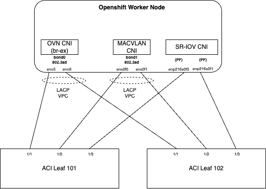
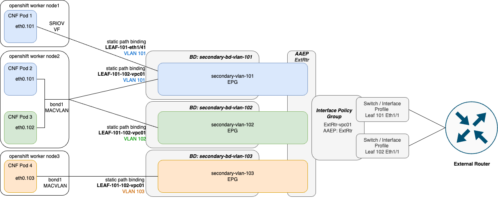
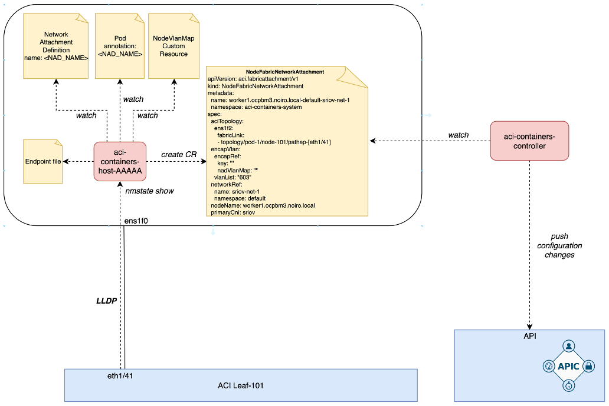
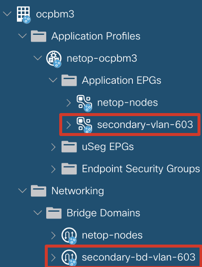
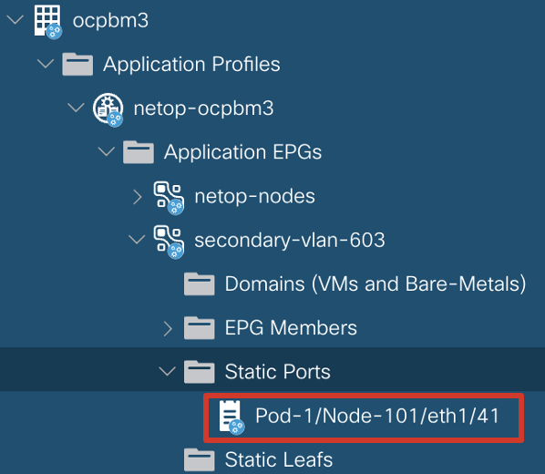
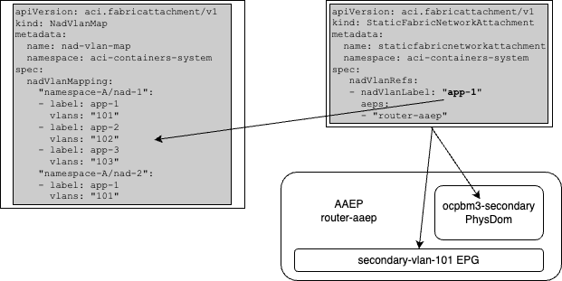
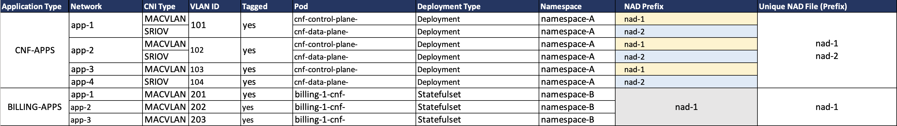

# Cisco Network Operator for Cisco Fabrics

# Table of Contents

- [1. Overview](#1-overview)
- [2. Features](#2-features)
- [3. Cisco Network Operator for Telco 5G cloud-native fabric orchestration](#3-cisco-network-operator-for-telco-5g-cloud-native-fabric-orchestration)
  - [3.1 Cisco ACI and Openshift node physical connectivity for CNO orchestration](#31-cisco-aci-and-openshift-node-physical-connectivity-for-cno-orchestration)
  - [3.2 Cisco ACI and Openshift cluster workloads logical network design](#32-cisco-aci-and-openshift-cluster-workloads-logical-network-design)
- [4 Network Operator software architecture](#4-network-operator-software-architecture)
- [5 Network Operator installation](#5-network-operator-installation)
  - [5.1 Network Operator installation pre-requisites](#51-network-operator-installation-pre-requisites)
  - [5.2. Network Operator installation](#52-network-operator-installation)
- [6. Network Operator - quick start guide](#6-network-operator---quick-start-guide)
  - [6.1 Network Operator - orchestrate fabric configurartion for SR-IOV interfaces connected to POD](#61-network-operator---orchestrate-fabric-configurartion-for-sr-iov-interfaces-connected-to-pod)
  - [6.2 Network Operator - orchestrate fabric configurartion for MACVLAN interfaces connected to POD](#62-network-operator---orchestrate-fabric-configurartion-for-macvlan-interfaces-connected-to-pod)
  - [6.3 6.3 Provisioning multiple VLANs within the same NetworkAttachmentDefiniton](#63-provisioning-multiple-vlans-within-the-same-networkattachmentdefiniton)
- [7. Custom features for Ericsson Packet Core support](#7-custom-features-for-ericsson-packet-core-support)
  - [7.1 Custom requirements](#71-custom-requirements)
  - [7.2 Network Operator implementation](#72-network-operator-implementation)
    - [7.2.1 NadVlanMap Custom Resource](#721-nadvlanmap-custom-resource)
    - [7.2.2 FabricVlanPool custom reosource](#722-fabricvlanpool-custom-reosource)
    - [7.2.3 External router port attachment](#723-external-router-port-attachment)
    - [7.2.4 VLAN file ingest](#724-vlan-file-ingest)
- [8. Primary CNI chaining (tech-preview)](#8-primary-cni-chaining-tech-preview)

## 1. Overview

Network Operator enables 5G platform operators to specify configuration intent for Container Network Function (CNF) interfaces natively using Kubernetes resources and annotations. 
Because the Network Operator is written as a fully compliant Kubernetes Operator, it continuously reconciles the state of the Cisco fabric, the Kubernetes scheduler, and each CNF interface configuration to ensure required network resources are provided and configured appropriately at each Kubernetes node so that CNFs can consume them.

Now, a 5G platform operator can dynamically reconfigure and scale CNFs and the Cisco Network Operator will ensure that the Network Fabric is provisioned and re-provisioned as necessary.

## 2. Features
This release includes the following features:

* An Extensible Framework for CNI Lifecycle Management and Reporting
* Cisco Data Center Fabrics automation for 5G cloud-native workloads
    * Cisco ACI automation for Pods secondary interfaces VLAN stitching
    * VLAN pools management
    * SR-IOV and MACVLAN plugin CNI support
    * L2 design for fabric
    * Dynamically create BD/EPG and port attachments to the relevant Openshift nodes
    * External router attachment


## 3. Cisco Network Operator for Telco 5G cloud-native fabric orchestration

Openshift nodes are installed with the primary OVN Kubernetes CNI and Network Operator CNI chained under multus. CNI chaining allows to insert Network Operator to the chain of the network operations and influence the pod lifecycle, ensure the network connectivity is present before the CNI informs kubelet and cri-o container runtime that network plumbing is successful.
Currently CNO has been validated with Openshift 4.12 running on baremetal servers.

The objective for Cisco Network Operator in the present phase of development is to manage network attachment for secondary interfaces, set up required configuration in Cisco ACI fabric, and operate as an Operator to consistently uphold the configuration's intent.

### 3.1 Cisco ACI and Openshift node physical connectivity for CNO orchestration

|  |
|:--:|
| *Openshift node physical connectivity to ACI* |

In this topology, Openshift nodes can connect to ACI Leafs using multiple interfaces. Each pair of interfaces serves a different purpose:

1. The primary POD network is managed by Openshift OVN-Kubernetes CNI and uses interfaces aggregated in the logical bond0 interface.
2. The MACVLAN CNI plugin utilizes interfaces aggregated in the bond1 logical interface.
3. The last pair of interfaces is not aggregated, but both can be used for SR-IOV Physical Functions, which will be subsequently virtualized into Virtual Functions.

### 3.2 Cisco ACI and Openshift cluster workloads logical network design

Network Operator is deployed on the Openshift cluster, and it is responsible for orchestrating the ACI fabric configuration and influencing the pod scheduling process based on network readiness, utilizing CNI chaining technology.

For each network segment, there is a corresponding BD (Bridge Domain) and EPG (End Point Group) in ACI.

Explicit physical interface and VLAN attachments are made to the relevant BD and EPG in ACI.

The BDs are configured as L2, so it is expected to connect an external router to each EPG to provide a gateway. CNO has implemented automatic attachment of the external router interface to the EPG based on a configurable mapping.

The attachment of pods to the Network Segment is accomplished through the use of a Multus Custom Resource called NetworkAttachmentDefinition (short: NAD).

|  |
|:--:|
| *ACI logical network design* |

## 4 Network Operator software architecture

Network Operator can be installed after deploying an Openshift cluster with the primary OVN-Kubernetes CNI.

To install Network Operator, you can use the [acc-provision](https://pypi.org/project/acc-provision/6.0.3.1/) tool, which will generate Kubernetes manifests and prepares Cisco ACI day-0 configuration. 

Optionally, you can use acc-provision tool to pre-provision Cisco ACI networking for the Openshift cluster connectivity for primary CNI.

Network Operator runs as a pods in the Openshift cluster inside the `aci-containers-system` namespace. Network Operator consists of following components:

* One pod aci-containers-controller deployment. It's main functions are:
  * subscribe to APIC selected objects and push configuration to APIC
  * Read the `nodenetworkstates.nmstate.io` CRD to discovers secondary connections using LLDP
* aci-container—host daemonset running on every node. 
  * it consists of 1 container - hostAgent which has following functions:
    * watch for NetworkAttachmentDefinitions
    * watch for Pods with additional network attachments
    * generates NodeFabricNetworkAttachment CR and other supplemental CRs explained later.



## 5 Network Operator installation

### 5.1 Network Operator installation pre-requisites

Before installation of the chained CNI to automate ACI fabric stitching for secondary interfaces, the following pre-requisites must be met:

1.	Install Openshift on Baremetal (validated installation methods: assisted-installer or UPI with PXE boot). Validated Openshift version: 4.12
2.	Install the following operators:
    * Multus (Openshift installation enables by default installation of multus)
    * SRIOV Operator
    * NMstate Operator
    * Ensure that LLDP is disabled on the NIC firmware
      * i.e. for Intel X710 `ethtool --set-priv-flags <eth_name> disable-fw-lldp on`
      * Note: This configuration should be implemented with a `machineconfig` otherwise will not persist between reboots
    * Enable LLDP on the node uplink interfaces designed for secondary interfaces.
      * i.e. using [nmstate](https://nmstate.io/features/lldp.html) operator


### 5.2. Network Operator installation

1. Install acc-provision on a host that has access to APIC.

    `pip install acc-provision==6.0.3.1`

2.  Prepare a YAML file named "acc-provision-input.yaml" that includes initial information about the environment, such as the APIC IP address, Tenant, VRF, CNI image registry information, and any additional parameters specified in the document. Please refer to the example "acc-provision-input-config.yaml" file for reference.

```yaml
aci_config:
  system_id: ocpbm3                   # Unique cluster name, if the Tenant is not specified this is also the tenant name
  tenant:
    name: ocpbm3                      # Add pre_existing_tenant name if it's manually created on the APIC
  apic_hosts:                         # List of APIC hosts to connect for APIC API
    - 10.0.0.1
  aep: ocp-bm-3                       # The AEP for primary CNI used by this cluster
  physical_domain:
    domain: ocp-bm-3-ovn              # physical domain name used for primary interfaces (will be attached to AAEP provided).
  vrf:                                # This VRF used for primary and secondary BDs
    name: ocp-bm-3-vrf
    tenant: common                    # Tenant where VRF is defined
  l3out:
    name: ocp3-extnet                 # Used to attach contract between primary CNI network and external world
    external_networks:
    - ocpbm3-extnet-epg               # Used for external contracts
  secondary_aep: ocp-bm-3-multus      # AAEP for secondary CNI interfaces

net_config:
  # node_subnet: 10.10.0.1/24         # Subnet to use for nodes IGNORED SINCE WE SET true for skip_node_network_provisioning
  # kubeapi_vlan: 502                 # The VLAN used by the physdom for nodes IGNORED SINCE WE SET true for skip_node_network_provisioning
 
chained_cni_config: 
  secondary_interface_chaining: true   # enable chained config
  use_global_scope_vlan: true              # use unique VLANs per leaf switch.
  skip_node_network_provisioning: true     # if true, Cisco CNI do not provision EPG/BD for node network (must be provisioned before Openshift cluster will be installed).
  vlans_file: "nad_vlan_map_input.csv"     # path to the CSV file with the VLAN information.
  # primary_interface_chaining: false      # (optional) enable CNI chaining for primary CNI – Network Operator will check connectivity to gateway prior allowing Pod to start. Currently not supported by Red Hat.
  # primary_cni_path: "/mnt/cni-conf/cni/net.d/10-ovn-kubernetes.conf” # (optional) if specified, primary CNI will be chained as well – this is not required by current use-case.
  secondary_vlans: [101,102,103,104,201]   # (optional) definite list of all vlans that should be populated in VLAN Pool for secondary intefaces

registry:                                  # Registry information 
  image_prefix: quay.io/noiro
  aci_containers_host_version: 6.0.3.1.81c2369       # for production use GA image tag 6.0.3.1.81c2369   
  aci_containers_controller_version: 6.0.3.1.81c2369 # for production use GA image tag 6.0.3.1.81c2369
```

3. Specific parameters for Network Operator in chained mode:

You can create new Tenant or use pre-existing one:
```yaml
aci_config:
  system_id: ocpbm3        # Unique cluster name, if the Tenant is not specified this is also the tenant name
  tenant:
    name: ocpbm3           # Add pre_existing_tenant name if it's manually created on the APIC
```
* 2 AAEPs should be created before running acc-provision (prerequisite):
  * `aci_config.aep` - AAEP for primary CNI interfaces
  * `aci_config.secondary_aep` - AAEP for secondary CNI interface
* 2 Physical Domains (can be provided or if not specified, will be created):
  * `aci_config.physical_domain.domain` - Phys Dom for primary CNI interfaces (should exists)
  * Phys Dom for secondary CNI interfaces – automatically created with the name: `<system_id>-secondary`
* `chained_cni_config.secondary_interface_chaining` – enables CNI chaining with MACVLAN and SRIOV CNI plugins for secondary interfaces.
* `chained_cni_config.skip_node_network_provisioning` - Network provisioning for primary CNI (BD/EPG is specific VRF / Tenant, contract to provided L3out).
* `chained_cni_config.use_global_scope_vlan` – for a given VLAN one EPG is created even if multiple Network Attachment Definition refers to the same VLAN. If False, for each NAD using the same VLAN unique EPG will be created. 
* `chained_cni_config.vlans_file` – read CSV file to load VLAN id and create NadVlanMap Custom Resource at Day-0. This feature has been developed to meet specific Customer CNF operation guidance.
* `chained_cni_config.secondary_vlans` – List of VLANs used by CNO to provision VLAN Pool attached to <system_id>-secondary physical domain. This domain is attached to the EPGs created by CNO. If ip_sheet is specified, the vlan pool can be populated from the excel sheet.

4. Run acc-provision on the host that has access to APIC. Script will generate output file. 

   __Warning__: This steps will push configuration to APIC

```bash
acc-provision -a -c acc-provision-config.yml -u <apic_user> -p <apic_password> -f openshift-sdn-ovn-baremetal -o acc_deployment.yaml
```
5. Apply the output file to the openshift cluster

```bash
oc apply -f acc_deployment.yaml
```

6. Once manifest applied to the Openshift cluster, you should see following resources:

```
[root@ocp-3-orch macvlan-2]# oc get pods -n aci-containers-system -o wide
NAME                                         READY   STATUS    RESTARTS   AGE     IP             NODE                         NOMINATED NODE   READINESS GATES
aci-containers-controller-57c766b7cd-ljfp6   1/1     Running   0          3h39m   192.168.23.7   worker2.ocpbm3.noiro.local   <none>           <none>
aci-containers-host-4mwk8                    1/1     Running   0          4h9m    192.168.23.3   master1.ocpbm3.noiro.local   <none>           <none>
aci-containers-host-c42nq                    1/1     Running   0          4h9m    192.168.23.7   worker2.ocpbm3.noiro.local   <none>           <none>
aci-containers-host-cpl98                    1/1     Running   0          4h8m    192.168.23.4   master2.ocpbm3.noiro.local   <none>           <none>
aci-containers-host-s4trc                    1/1     Running   0          4h9m    192.168.23.6   worker1.ocpbm3.noiro.local   <none>           <none>
aci-containers-host-x2q6w                    1/1     Running   0          4h9m    192.168.23.5   master3.ocpbm3.noiro.local   <none>           <none>
```
Installed CRDs:

```
[root@ocp-3-orch macvlan-2]# oc get crd | grep aci.fabricattachment
nadvlanmaps.aci.fabricattachment                                  2023-08-09T12:21:05Z
nodefabricnetworkattachments.aci.fabricattachment                 2023-07-24T22:28:18Z
staticfabricnetworkattachments.aci.fabricattachment               2023-08-25T09:32:49Z
fabricvlanpool.aci.fabricattachment                               2023-09-14T20:13:23Z
```
Depending on configuration, if you provided nad-vlan-file.csv to the input, you should see `nadvlanmap` Custom Resource created and fabricvlanpool. 

Default FabricVlanPools Custom Resource:
```
[root@ocp-3-orch ~]# oc get fabricvlanpools.aci.fabricattachment -A
NAMESPACE               NAME            AGE
aci-containers-system   default         14d
```

If the NadVlanMap file has been provided in aci-prov-input.yaml file, you should see NadVlanMap Custom Resource created:
```
[root@ocp-3-orch ~]# oc get nadvlanmaps.aci.fabricattachment
NAME           AGE
nad-vlan-map   19d
```
## 6. Network Operator - quick start guide

**&#9432;** ___NOTE:___ _Make sure to have Multus installed, LLDP enabled on the interfaces used to attach additional networks to the pods_

### 6.1 Network Operator - orchestrate fabric configurartion for SR-IOV interfaces connected to POD

1. Create `SriovNetworkNodePolicy`, refer for details how to use SR-IOV Operator in [documentation](https://github.com/openshift/sriov-network-operator).

Example: 
```yaml
apiVersion: sriovnetwork.openshift.io/v1
kind: SriovNetworkNodePolicy
metadata:
generation: 1
  name: sriov-policy-enp216s0f0-0-15
  namespace: openshift-sriov-network-operator
spec:
  deviceType: netdevice
  isRdma: false
  needVhostNet: false
  nicSelector:
    deviceID: 158b
    pfNames:
    - enp216s0f0#0-63
    rootDevices:
    - 0000:d8:00.0
    vendor: "8086"
  nodeSelector:
    feature.node.kubernetes.io/network-sriov.capable: "true"
  numVfs: 64
  priority: 99
  resourceName: enp216s0f0
```

2. Create `NetworkAttachmentDefinition` (NAD)
```yaml
apiVersion: k8s.cni.cncf.io/v1
kind: NetworkAttachmentDefinition
metadata:
  annotations:
    k8s.v1.cni.cncf.io/resourceName: openshift.io/enp216s0f0
name: sriov-net1
  namespace: default
spec:
  config: |
{
    "cniVersion": "0.3.1",
    "name": "sriov-net1",
    "plugins": [
        {
            "name": "sriov-net1",
            "cniVersion": "0.3.1",
            "type": "sriov",
            "vlan": 603,
            "trust": "on",
            "vlanQoS": 0,
            "capabilities": {
                "ips": true
            },
            "link_state": "auto",
            "ipam": {
                "type": "static",
                "addresses": [
                    {
                        "address": "192.168.128.66/24"
                    }
                ]
            }
        },
################################################
#        ADD THIS SECTION TO THE NAD:          #
################################################
        { 
            "supportedVersions": [
                "0.3.0",
                "0.3.1",
                "0.4.0"
            ],
            "type": "opflex-agent-cni",
            "chaining-mode": true,
            "log-level": "debug",
            "log-file": "/var/log/netopcni.log"
        }
###############################################
    ]
}
```
Once NAD is created Network Operator creates Bridge Domain / Endpoint Group in Cisco ACI for the VLAN specified in the NetworkAttachmentDefinition. The name of EPG and BD are hardcoded using the following schema: 
* `secondary-vlan-<vlanID>`
* `secondary-bd-vlan-<vlanID>`

| 
|:--:|
| *BD/EPG created in Cisco ACI after NAD deployment* |

`aci-containers-host` watches for NAD creation and creates `NodeFabricNetworkAttachment` (NFNA) Custom Resource per NAD and per Openshift node on which the NetworkAttachmentDefinition applies. 

NFNA aggregates information about:
  * Host interface and discovered port on ACI
  * Pod reference (will be visible after scheduling pod attached to the NAD)
  * VLAN ID or multiple IDs
  * Reference to the NAD
  * Reference to the node
  * Primary CNI in the chain (this is still CNI for secondary interfaces, but it is called primary in the CNI chain)
```bash
[root@ocp-3-orch ~]# oc get nodefabricnetworkattachments.aci.fabricattachment -n aci-containers-system
NAME                                             AGE
worker1.ocpbm3.noiro.local-default-sriov-net-1   85m
worker2.ocpbm3.noiro.local-default-sriov-net-1   85m
```
```yaml

[root@ocp-3-orch ~]# oc get nodefabricnetworkattachments.aci.fabricattachment -n aci-containers-system   worker1.ocpbm3.noiro.local-default-sriov-net-1 -o yaml
apiVersion: aci.fabricattachment/v1
kind: NodeFabricNetworkAttachment
metadata:
  name: worker1.ocpbm3.noiro.local-default-sriov-net-1
  namespace: aci-containers-system
spec:
  aciTopology:
    ens1f2:
      fabricLink:
      - topology/pod-1/node-101/pathep-[eth1/41]
  encapVlan:
    encapRef:
      key: ""
      nadVlanMap: ""
    vlanList: "603"
  networkRef:
    name: sriov-net-1
    namespace: default
  nodeName: worker1.ocpbm3.noiro.local
  primaryCni: sriov
  ```

3. create a Pod, refer to the additional network attachment using annotation:

```yaml
apiVersion: v1
kind: Pod
metadata:
  name: multitool-sriov-demo-1
  namespace: default
  annotations:
    k8s.v1.cni.cncf.io/networks: sriov-net-1
  labels:
    run: multitool
spec:
  containers:
  - name: network-multitool
    image: wbitt/network-multitool
  nodeName: worker1.ocpbm3.noiro.local
```

Pod scheduled on specific worker node (worker1). Network Operator configure Static Path towards the node that runs a Pod attached to the NAD.
The interface is taken from NodeFabricNetworkAttachment Custom Resource. 


|  | 
| :--: |
| *Static Port configured under EPG* |

Network Operator compute and maintains NodeFabricNetworkAttachment resource in Kubernetes. Example of a resource after creating NAD and attach Pod to it:

```yaml
apiVersion: aci.fabricattachment/v1
kind: NodeFabricNetworkAttachment
metadata:
  name: worker1.ocpbm3.noiro.local-default-sriov-net-1
  namespace: aci-containers-system
spec:
  aciTopology:
    ens1f2:                                       
      fabricLink:
      - topology/pod-1/node-101/pathep-[eth1/41]  # Discovered fabric interface
      pods:
      - localIface: ens1f2v34                     # Pod details with VF interface
        podRef:
          name: multitool-sriov-demo-1
          namespace: default
  encapVlan:
    encapRef:
      key: ""
      nadVlanMap: ""
    vlanList: "603"                               # VLAN information
  networkRef:
    name: sriov-net-1
    namespace: default
  nodeName: worker1.ocpbm3.noiro.local            # Node for which this NFNA has been created.
  primaryCni: sriov                               # CNI plugin used
```

### 6.2 Network Operator - orchestrate fabric configurartion for MACVLAN interfaces connected to POD

Similarly to SR-IOV interfaces, additional interfaces managed by MACVLAN CNI are supported by Network Operator. It will configured Cisco ACI fabric with relevant Static Ports under EPG. In case of bonded uplink, Network Operator discovers port-channel members and configures static port under EPG referring to the Virtual Port-Channel or Port-Channel Interface Group Policy.

In order to specify VLAN ID in the NetworkAttachmentDefinition directly, configure subinterface on the uplink that will be used by MACVLAN, and refer subinterface in NetworkAttachmentDefinition.

Example:
1. Create subinterface on bond1 port-channel interface on worker2 using NMState Operator.

```yaml
apiVersion: nmstate.io/v1beta1
kind: NodeNetworkConfigurationPolicy
metadata:
  name: bond1.604-worker2
spec:
  nodeSelector:
    kubernetes.io/hostname: worker2.ocpbm3.noiro.local
  desiredState:
    interfaces:
    - name: bond1.604
      type: vlan
      state: up
      vlan:
        base-iface: bond1
        id: 604
```

2. Create NetworkAttachmentDefinition

```yaml
apiVersion: k8s.cni.cncf.io/v1
kind: NetworkAttachmentDefinition
metadata:
  name: macvlan-net2-bond1-604
  namespace: default
spec:
  config: |
{
    "cniVersion": "0.3.1",
    "name": "macvlan-net2-bond1-604",
    "plugins": [
        {
            "cniVersion": "0.3.1",
            "name": "macvlan-net2-bond1-604",
            "type": "macvlan",
            "mode": "private",
            "master": "bond1.604",
            "ipam": {
                "type": "whereabouts",
                "range": "192.168.100.0/24",
                "exclude": [
                    "192.168.100.0/32",
                    "192.168.100.1/32",
                    "192.168.100.254/32"
                ]
            }
        },
        {
            "supportedVersions": [
                "0.3.0",
                "0.3.1",
                "0.4.0"
            ],
            "type": "opflex-agent-cni",
            "chaining-mode": true,
            "log-level": "debug",
            "log-file": "/var/log/opflexagentcni.log"
        }
    ]
}
```

Network Operator reacts to the NetworkAttachmentDefinition create event, and will create NodeFabricNetworkAttachment for that specific NAD - again, one per node where the NAD is applicable. Network Operator will also push BD and EPG for VLAN-604 to the APIC.

3. Create Pod manifest

```yaml
apiVersion: v1
kind: Pod
metadata:
  name: multitool-macvlan-net2-pod2
  namespace: default
  annotations:
    k8s.v1.cni.cncf.io/networks: macvlan-net2-bond1-604
  labels:
    cni: macvlan
spec:
  containers:
  - name: network-multitool
    image: wbitt/network-multitool
  nodeName: worker2.ocpbm3.noiro.local
```
Network Operator will create a NodeFabricNetworkAttachment resource based on the NAD `macvlan-net2-bond1-604`

```yaml
apiVersion: aci.fabricattachment/v1
kind: NodeFabricNetworkAttachment
metadata:
  name: worker2.ocpbm3.noiro.local-default-macvlan-net2-bond1-604
  namespace: aci-containers-system
spec:
  aciTopology:
    bond1:                                         # Bond host interface reference
      fabricLink:
      - topology/pod-1/node-101/pathep-[eth1/43]   # Discovered individual interfaces through LLDP
      - topology/pod-1/node-102/pathep-[eth1/43]   # Discovered individual interfaces through LLDP
      pods:
      - localIface: net1
        podRef:
          name: multitool-macvlan-net2-pod2
          namespace: default
  encapVlan:
    encapRef:
      key: ""
      nadVlanMap: ""
    vlanList: "604"
  networkRef:
    name: macvlan-net2-bond1-604
    namespace: default
  nodeName: worker2.ocpbm3.noiro.local
  primaryCni: macvlan
```

Based on the Ethernet ports discovered by Network Operator, The Virtual Port Channel has been discovered and added to the EPG.

|  |
|:--:|
| *Static Port for VPC interface automatically discovered* |

### 6.3 Provisioning multiple VLANs within the same NetworkAttachmentDefiniton

NetworkAttachmentDefinition allows to specify VLAN ID in multiple ways, depending on the defined plugin CNI. For SR-IOV CNI, you can specify vlan ID in the plugins.vlan field - this will configure VLAN ID for the VF on the NIC card directly and NIC card will encapsulate traffic from the attached Pod on the wire.
In many 5G CNF use-cases, encapsulation is done on the Pod itself, and VF should be treated as a trunk allowing list of VLANs. 
Network Operator allows that configuration through annotation or reference to the resource "nad-vlan-map". The last one has been developed for specific use-case and is described in [Chapter 7.2.1](#721-nadvlanmap-custom-resource).
The standard way of configuring VLAN list for the NAD, and thus, Network Operator provisions appropriate network segments on Cisco ACI fabric, is through the annotations:

```yaml
apiVersion: k8s.cni.cncf.io/v1
kind: NetworkAttachmentDefinition
metadata:
  name: sriov-net1
  namespace: default
  annotations:
    netop-cni.cisco.com/vlans: ‘[100,103,106-108]’ 
    k8s.v1.cni.cncf.io/resourceName: openshift.io/<resourceName>
```

Above configurartion results in creating 5 BD/EPG in ACI for vlan: 100, 103, 106, 107, 108. When Pod will be attached to this NAD, the static binding will be created for each EPG created for each vlan from this list. Since it is unknown which VLAN a Pod will choose to encapsulate traffic, all vlans are allowed and provisioned for any pod attached to this NAD.


## 7. Custom features for Ericsson Packet Core support

### 7.1 Custom requirements

Ericsson 5G Packet Core application deployment on Openshift includes Network Attachment Definitions to connect pods to additional networks based on MACVLAN and SR-IOV. Here is a list of custom requirements for NAD specification:
(1) NAD manifest for SR-IOV has VLAN ID = 0, while NAD for MACVLAN refers to the parent bond interface, without subinterface. 
(2) NetworkAttachmentDefinition doesn't consists of VLAN ID, it is assumed that CNF PODs will trunk multiple VLANs. 
(3) Unique network segment (VLAN) will be shared across NetworkAttachmentDefinitions to connect CNF workloads using SR-IOV and MACVLAN CNI's. 
(4) Mapping of VLANs to NADs has been provided in form of excel spreadsheet, which is assumed to be a rather static, and part of DAY-1 configuration.
(5) Currently validated design assumes that Cisco ACI fabric acts as a Layer-2 switching network, routing between network segments will be configured centrally on the attached external router.

### 7.2 Network Operator implementation

Network Operator has been designed to address Ericsson requirements, and allow managing VLAN pools and maps them to the NetworkAttachmentDefinition.

#### 7.2.1 NadVlanMap Custom Resource

The Ericsson Packet Core application performs VLAN encapsulation inside the Pod network namespace, hence NetworkAttachmentDefinition does not have a VLAN ID specified. NAD only refers to the parent uplink interface (in case of MAC VLAN it will be parent interface) or refer to the SRIOV Network Node Policy name and VLAN ID = 0. 

Network Operator exposes Custom Resource named NadVlanMap, which provides mapping between NetworkAttachmentDefinition (NAD) name and possible VLAN ID's that are assumed to be used by PODs connected to the NAD.
Example manifest of the NadVlanMap:

```yaml
apiVersion: aci.fabricattachment/v1
kind: NadVlanMap
metadata:
  name: nad-vlan-map               # This is singleton resource, must use exact "nad-vlan-map" name
  namespace: aci-containers-system
spec:
  nadVlanMapping:
    namespace-A/nad-1:       # namespace (fullname match) / NADs prefix name (first letters match)
      - label: app-1         # Label is not used for matching NAD to VLAN.
        vlans: "101"
      - label: app-2
        vlans: "102"
      - label: app-3
        vlans: "103"
    namespace-A/nad-2:
      - label: app-1
        vlans: "101"         # the same vlans can be used by multiple NADs
      - label: app-2
        vlans: "102"
      - label: app-4
        vlans: "104"
    namespace-B/nad-1:       # NetworkAttachmentDefinition is a namespaced resource and can duplicate across namespaces
      - label: app-1
        vlans: "201"
```

NadVlanMapping provides list of VLANs to be assigned to the NAD. NAD key is using pattern: `<namespace>/<nad_name_prefix>`
**&#9432;** ___NOTE:___ _NadVlanMap resource is a singleton (one per cluster) resource and its name must be: “nad-vlan-map”_
The "label" attribute is not used for matching a specific VLAN to a Network Attachment Definition (NAD)/Pod. Instead, it is utilized by the StaticFabricNetworkAttachment, which will be explained in detail later in the document.

When NetworkAttachmentDefinition resource is created, Network Operator finds matching namespace / NAD name in the NadVlanMap, it creates as many BD/EPG pairs as the number of VLANs in the list for matched namespace/NAD prefix.

If you look at the above NadVlanMap, and you would create NAD with the name: `nad-1` in the namespace `namespace-A`, Network Operator will create BD and EPGs with the following names:
- ACI Bridge Domains (BD):
  - secondary-bd-vlan-101
  - secondary-bd-vlan-102
  - secondary-bd-vlan-103
- ACI Endpoint Groups (EPG):
  - secondary-vlan-101
  - secondary-vlan-102
  - secondary-vlan-103

Network Operator creates NodeFabricNetworkAttachment resource - one per NAD and per node. It will incorporate information about allowed VLAN list and reference to the matching entry in NadVlanMap resources. 

Example:

```yaml
apiVersion: aci.fabricattachment/v1
kind: NodeFabricNetworkAttachment
metadata:
  name: worker1.ocpbm3.noiro.local-namespace-A-nad-1
  namespace: aci-containers-system
spec:
  aciTopology:
    bond1:
      fabricLink:
      - topology/pod-1/node-101/pathep-[eth1/40]
      - topology/pod-1/node-102/pathep-[eth1/40]
  encapVlan:
    encapRef:
      key: namespace-A/nad-1                             # found matching in NadVlanMap
      nadVlanMap: aci-containers-system/nad-vlan-map     # reference to the NadVlanMap resource
    vlanList: '[101,102,103]'                            # list of VLANs defined in the NadVlanMap matching the Namespace/NAD prefix
  networkRef:
    name: nad-1
    namespace: namespace-A
  nodeName: worker1.ocpbm3.noiro.local
  primaryCni: macvlan
```

When Pod is created, it is expected that the POD will do VLAN tagging its `netX` interface. Consequently, the provisioning of static paths towards the relevant worker node is carried out across all Endpoint Groups (EPGs) that map the VLAN to that NetworkAttachmentDefinition (NAD).

When multiple NetworkAttachmentDefinitions refers to the same VLAN, and the Network Operator has been provisioned with the `chained_cni_config.use_global_scope_vlan` set to `true`, then Bridge Domain / Endpoint Group will be created only once, and every consecutive NAD that refer to the same VLAN will use exisiting BD EPG for attaching static port. 

Example: 

Network Operator creates NodeFabricNetworkAttachment for NetworkAttachmentDefinition with the name `nad-1` in namepsace `namespace-A`. In addition Pod has been created and attached to the NAD using annotation `"k8s.v1.cni.cncf.io/networks: nad-1"`
```yaml
apiVersion: aci.fabricattachment/v1
kind: NodeFabricNetworkAttachment
metadata:
  name: worker1.ocpbm3.noiro.local-namespace-A-nad-1
  namespace: aci-containers-system
spec:
  aciTopology:
    bond1:
      fabricLink:
      - topology/pod-1/node-101/pathep-[eth1/40]
      - topology/pod-1/node-102/pathep-[eth1/40]
      pods:
      - localIface: net1                                 
        podRef:                                          # Reference to the pod attached to the NAD.
          name: app-1
          namespace: namespace-A
  encapVlan:
    encapRef:
      key: namespace-A/nad-1                             # found matching in NadVlanMap
      nadVlanMap: aci-containers-system/nad-vlan-map     # reference to the NadVlanMap resource
    vlanList: '[101,102,103]'                            # list of VLANs defined in the NadVlanMap matching the Namespace/NAD prefix
  networkRef:
    name: nad-1
    namespace: namespace-A
  nodeName: worker1.ocpbm3.noiro.local
  primaryCni: macvlan
```
Another NAD - `nad-2` in the same namespace has been created, and Pod attached to it. For those resources, Network Operator creates another `NodeFabricNetworkAttachment` resource. 

```yaml
apiVersion: aci.fabricattachment/v1
kind: NodeFabricNetworkAttachment
metadata:
  name: worker1.ocpbm3.noiro.local-namespace-A-nad-2
  namespace: aci-containers-system
spec:
  aciTopology:
    ens1f2:                                        
      fabricLink:
      - topology/pod-1/node-101/pathep-[eth1/41]  # Discovered fabric interface
      pods:
      - localIface: ens1f2v34                     # Pod details with VF interface
        podRef:
          name: app-1
          namespace: namespace-A
  encapVlan:
    encapRef:
      key: namespace-A/nad-2                             # found matching in NadVlanMap
      nadVlanMap: aci-containers-system/nad-vlan-map     # reference to the NadVlanMap resource
    vlanList: '[101,102,104]'                            # list of VLANs defined in the NadVlanMap matching the Namespace/NAD prefix (nad-2)
  networkRef:
    name: nad-2
    namespace: namespace-A
  nodeName: worker1.ocpbm3.noiro.local
  primaryCni: sriov
```

Network Operator will create only one new BD/EPG for vlan 104, since it does not overlap with any previously created BD/EPGs. 
For the Pod, Network Operator will create Static Port in two existing EPGs vlan-101 and vlan-102 refering to the interface Eth1/41 on Leaf 101 and add vlan encapsulation respectively for each EPG. 

#### 7.2.2 FabricVlanPool custom reosource

You can maintain list of VLAN mapping to NADs by editing NadVlanMaps resource, and add/remove vlans, NAD prefixes. This will update the list of EPGs that will be created when new NAD will be created, however, it does not update the VLAN Pool `“<systemID>-secondary”` in Fabric Access Policies. 

After Network Operator installation, acc-provision generates `FabricVlanPool` resource named `“default”` in `aci-containers-system` namespace. It will consists all VLANs specified in the net_config.secondary_vlans list (one of the acc-provision-input parameters), or if the secondary_vlan list is not provided, the VLAN list will be derived from input `nad_vlan_map_input.csv` file.
You can create additional FabricVlanPool CRDs in another namespace and add more vlans to the VLAN Pool in Fabric access policies. 
The VLAN Pool will be always union of all users defined FabricVlanPools and the default one. 

```yaml
apiVersion: aci.fabricattachment/v1
kind: FabricVlanPool
metadata:
  name: default                      # default FabricVlanPool
  namespace: aci-containers-system
spec:
  vlans:
  - "101-104"
  - "201"
```

You can add more vlans by editing the `default` FabricVlanPool resource, or by creating your own in the namespace where your NAD definition will be created. 

**&#9432;** ___NOTE:___ _when no match will be found for NAD prefix name in the NadVlanMap, Network Operator will create BD/EPGs for each VLAN defined in the FabricVlanPool `default` and FabricVlanPool in the namespace where NAD is created._ 

If multiple application owners requires Network Operator to automate Cisco ACI configuration for their own CNF applications, you can assign VLAN ranges per application owner, and create dedicated FabricVlanPools for each of them in their respective namespaces. You can skip populating `default` FabricVlanPool by not providing `chained_cni_config.secondary_vlan` list nor `chained_cni_config.vlans_file` input file, and leverage only user created `FarbicVlanPool` resources.

#### 7.2.3 External router port attachment

Cisco ACI fabric acts as a layer 2 switched network for a Pod secondary interfaces. Routing to the other subnets will be performed on an external router that should be attached to the same VLAN. To automate attachment of an external gateway uplink to each EPG, the additional Custom Resource has been defined. `StaticFabricNetworkAttachment` is a CRD that matches label from `NadVlanMap` and AAEP where the external router is connected.

Based on above custom resource, Network Operator matches VLAN and EPG name based on label in the `NadVlanMap` and associates it with defined AAEP. There is no static port added to the EPG for the router, just all interfaces that belongs the the AAEP will get programmed a VLAN that matches the label.

**&#9432;** ___NOTE:___ _A prerequisite for this implementation is to dedicate unique AAEP for external router. CNO doesn’t do specific staticPath binding to each epg for external router, rahter it is associating EPG with AAEP in __Fabric -> Access Policies -> Policies -> Global -> Attachable Access Entity Profile__._

Example StaticFabricNetworkAttachment resource:

```yaml
apiVersion: aci.fabricattachment/v1
kind: StaticFabricNetworkAttachment
metadata:
  name: staticfabricnetworkattachment
  namespace: aci-containers-system
spec:
   nadVlanRefs:
   - nadVlanLabel: "app-1"   # Option 1: Match EPG based on the label defined in NadVlanMap
     aeps:
     - "router-aaep"
   vlans:
   - vlans: "101"            # Option 2: Match EPG based on explicit VLAN ID
     aeps:
     - "router-aaep"
```
VLAN can be directly specified or to a label that is defined in the NadVlanMaps CR to associate an AEP but anyway, it must match to a VLAN that is defined in the FabricVlanPool, otherwise VLAN Pool in APIC won’t have that Vlan and fault will be raised

|  |
|:--:|
| *StaticFabricNetworkAttachment logical diagram* |


#### 7.2.4 VLAN file ingest

Network Operator can load VLAN mapping data at the time of installation from a *.csv. Based on the information provided in the spreadsheet, NadVlanMap manifest will be generated in the acc-provision output file.

|  |
|:--:|
| *VLAN spreadsheet format* |

Excel sheet has to be converted to CSV format and path to the file has to be specified in the acc-provision-input.yaml as:

```yaml
chained_cni_config.vlans_file: "nad_vlan_map_input.csv"
```
In this example, `nad_vlan_map_input.csv` has been located in the current directory from which acc-provision will be executed.

the NadVlanMap populated with the information from CSV file will be part of acc-provision-output.yaml

```bash
acc-provision -a -f openshift-sdn-ovn-baremetal -u admin -p ”password” -c acc_provision_input.yaml -o acc-provision-output.yaml
```
## 8. Primary CNI chaining (tech-preview)

**&#9432;** ___NOTE:___ _This is tech-preview feature, not currently supported in production environments._

The CNI chaining for primary CNI (OVN-Kubernetes) has been implemented but turned off by default while Cisco is working with Red Hat to certify CNI chaining for OVN-Kubernetes.
CNI chaining for primary interface add the capability to detect network issues and prevent Pods scheduling while the networing is not ready.

You can enable OVN-Kubernetes CNI chaining with Cisco Network Operator by adding following configuration options to the acc-provision-input.yaml file:
- `chained_cni_config.primary_interface_chaining: true` - enable feature
- `primary_cni_path: "/mnt/cni-conf/cni/net.d/10-ovn-kubernetes.conf"`- indicate path to the primary CNI configuration file.
Once CNI chaining is enabled for primary interface and Network Operator deployed on the cluster, all nodes multus configuration for ovn-kubernetes located in each node filesystem: (`/run/multus/cni/net.d/10-ovn-kubernetes.conf`) will have additional entry:

```json
{
 	"name": "ovn-kubernetes",
 	"cniVersion": "0.4.0",
 	"plugins": [{
 		"cniVersion": "0.4.0",
 		"name": "ovn-kubernetes",
 		"type": "ovn-k8s-cni-overlay",
 		"ipam": {},
 		"dns": {},
 		"logFile": "/var/log/ovn-kubernetes/ovn-k8s-cni-overlay.log",
 		"logLevel": "4",
 		"logfile-maxsize": 100,
 		"logfile-maxbackups": 5,
 		"logfile-maxage": 5
  },
  {
    "_comment": "CNO CNI CHAINING INFORMATION WILL BE ADDED:"
  },
  {
 		"supportedVersions": ["0.3.0", "0.3.1", "0.4.0"],
 		"type": "netop-cni",
 		"chaining-mode": true,
 		"log-level": "debug",
 		"log-file": "/var/log/netop-agent.log"
 	}]
}
 ```

**&#9432;** ___NOTE:___ _enabling CNI chaining on primary interface require restart of multus PODs (the same applies to disabling CNI chaining)_
```bash
oc delete pod -n openshift-multus -l app=multus
```
